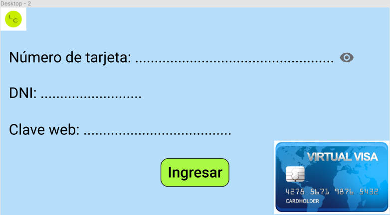
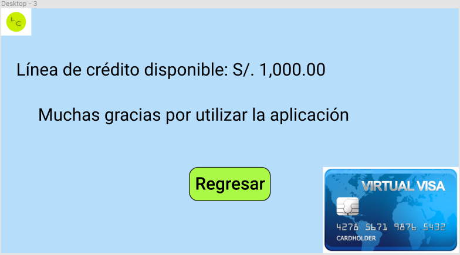

# Tarjeta de Crédito Válida 💳

## Índice

* [1. Objetivos de aprendizaje](#1-Objetivos-de-aprendizaje-)
* [2. Definición del producto](#2-Definición-del-producto-)
* [3. Prototipo en papel](#2-Prototipo-en-papel-)
* [4. Prototipo en Figma](#2-Prototipo-en-Figma-)

***

## 1. Objetivos de aprendizaje 💥

En objetivos de aprendizaje se trató de emplear de la mejor manera las tecnologías de HTML, CSS y JavasScript; sin embargo, aún me falta afianzar los conocimientos de dichas tecnologías para poder obtener un mejor resultado.

## 2. Definición del producto

LABOCREDIT

Para este proyecto se pensó en los clientes de una entidad financiera llamada "Labocredit" que necesitan acceder a la página web de la entidad para verificar la línea de crédito asignada a su tarjeta de crédito. Se consideró esos tipos de clientes, ya que he tenido un mayor contacto con la página web de una entidad financiera.

* Los principales usuarios del producto son los clientes de la entidad financiera (Labocredit) que han adquirido una tarjeta de crédito.
* El objetivo de los usuarios es verificar el importe de la línea de crédito asignada por la financiera.
* El producto creado resuelve el problema de los usuarios de tener que llamar a la financiera para que le validen la línea de crédito, sino que ya lo puede hacer desde la página de la misma entidad ahorrando tiempo.

La página web se accede desde la internet, y también se puede descargar desde las tiendas virtuales de los celulares colocando el nombre de la entidad financiera.

## 3. Prototipo en papel

### Feedback recibido

    - Colocar el logo de la entidad financiera a la izquierda
    - Solo hacer tres pantallas
    - Que la clave web no se vea cuando se digite
    - Ya no sería necesario que vean su estado de cuenta
    - Colocar un agradecimiento por visitar la página de Labocredit
  

## 4. Prototipo en Figma

 ### 4.1. Pantalla inicial:

 

 ### 4.2. Pantalla de solicitud de datos:

 

 ### 4.3. Pantalla final:

 

***

